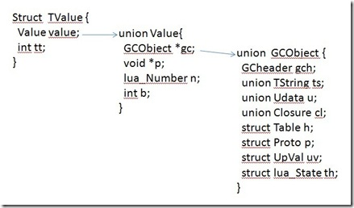

### 目录
1. table
2. string
3. GC
4. Closure 闭包


##### lua基本数据类型简述
1. 首先lua介绍lua的8种基本数据类型：
	- 定义在lua.h
	```
		#define LUA_TNIL		0
		#define LUA_TBOOLEAN		1
		#define LUA_TLIGHTUSERDATA	2
		#define LUA_TNUMBER		3
		#define LUA_TSTRING		4
		#define LUA_TTABLE		5
		#define LUA_TFUNCTION		6
		#define LUA_TUSERDATA		7
		#define LUA_TTHREAD		8
		#define LUA_NUMTAGS		9
	```
	- 数据对象定义在lobject.h, 可以看出TValue是一个结构体，里面是TValuefields，由一个宏定义构成。TValuefields包含Value和一个int类型的值，这里的tt_比较有意思存放lua的数据类型。而Value是一个联合体，关于联合体这里不做阐述。
	Value中的由一个gc指针，这里是被GC管理的对象，这个以后学习GC算法的时候在概述。
	p是light userdata的指针。i,n是int和float类型的numbers。
		- 这里要说明下[union的使用和初始化](http://c.biancheng.net/view/375.html)
		- union区别于typedef最大的一点是union所有的成员在内存中从同一地址开始

	- TValue 结构图如下：
	
	
	```
	// 所有需要GC操作的数据都会加一个CommonHeader类型的宏定义
	// next指向下一个GC链表的数据
	// tt代表数据的类型以及扩展类型以及GC位的标志
	// marked是执行GC的标记为，用于具体的GC算法
	#define CommonHeader  GCObject *next; lu_byte tt; lu_byte marked
	/*
	** Common type has only the common header
	*/
	struct GCObject {
	  CommonHeader;
	};
	/*
	** Union of all Lua values
	*/
	typedef union Value {
	  GCObject *gc;    /* collectable objects */
	  void *p;         /* light userdata */
	  int b;           /* booleans */
	  lua_CFunction f; /* light C functions */
	  lua_Integer i;   /* integer numbers */
	  lua_Number n;    /* float numbers */
	} Value;
	#define TValuefields	Value value_; int tt_
	typedef struct lua_TValue {
	  TValuefields;
	} TValue;
	```