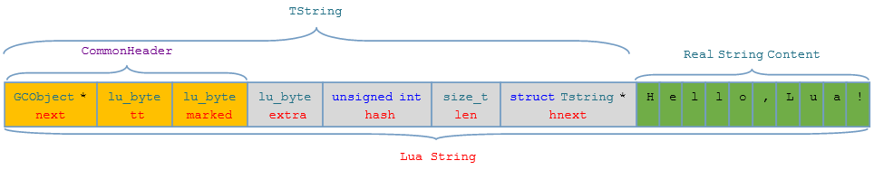
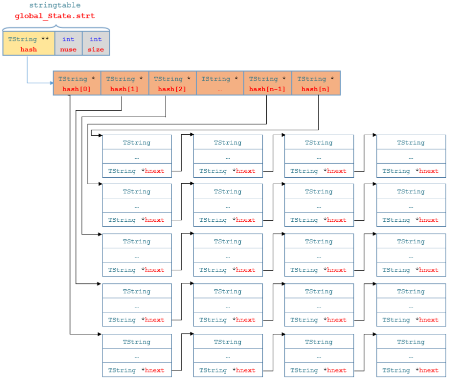
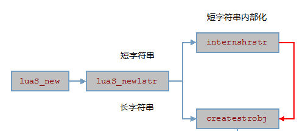

string的设计与实现 [参考博客](https://www.cnblogs.com/heartchord/p/4561308.html)


### string 
- lua字符串内部被分为短字符串和长字符串，长字符串是为了处理http长文本所作出的优化。
字符串一经被创建就不可改写，Lua的值对象若为字符串类型，则它将以引用方式存在
- 同样的string的数据结构也是被定义在了lobject.h里面
```
typedef struct TString {
  CommonHeader;
  lu_byte extra;  /* reserved words for short strings; "has hash" for longs */
  lu_byte shrlen;  /* length for short strings */
  unsigned int hash;
  union {
    size_t lnglen;  /* length for long strings */
    struct TString *hnext;  /* linked list for hash table */
  } u;
} TString;
```
- CommonHeader 用于GC的对象
- extra 用于记录辅助信息。对于短字符串，该字段用来标记字符串是否为保留字，用于词法分析器中对保留字的快速判断；对于长字符串，该字段将用于惰性求哈希值的策略（第一次用到才进行哈希）。
- hash 记录字符串的哈希值，可以用来快速的查找和匹配。
- shrlen 用于记录短字符串的长度。
- 结构体u 里面lnglen记录长字符的长度。 hnext域用来指向 hash table 中相同哈希值的下一个字符串。
- TString 结构图如下：

	- lua字符串对象 = TString + 实际字符串数据
	- TString结构 = GCObject指针 + 字符串信息数据

#### 短字符串与长字符串
- lua字符串内建类型定义在lua.h中
```
// lua.h
#define LUA_TSTRING		4
```
- 对于长短字符串来说，Lua在 LUA_TSTRING的宏上扩展了两个小类型
```
//lobject.h
/* Variant tags for strings */
#define LUA_TSHRSTR	(LUA_TSTRING | (0 << 4))  /* short strings */
#define LUA_TLNGSTR	(LUA_TSTRING | (1 << 4))  /* long strings */
```
- 对短字符串的限制，在Lua的设计中，元方法名和保留字必须是短字符串，所以短字符串长度不得短于最长的元方法__newindex和保留字function的长度，也就是说LUAI_MAXSHORTLEN最小不可以设置低于10（字节）。
```
// llimits.h
/*
** Maximum length for short strings, that is, strings that are
** internalized. (Cannot be smaller than reserved words or tags for
** metamethods, as these strings must be internalized;
** #("function") = 8, #("__newindex") = 10.)
*/
#if !defined(LUAI_MAXSHORTLEN)
#define LUAI_MAXSHORTLEN	40
#endif
```

#### 字符串管理
- 在lua中，字符串是被内化的一种数据结构，内化的意思就是说，每个存放lua字符串的变量，实际上存放的并不是一份字符串的数据副本，而是这份字符串的引用，因此，在lua中字符串是一个不可变的数据，然后呐，为了实现内化，在lua虚拟机中必然要存在一个全局的地方存放当前系统中的所有字符串，lua虚拟机使用一个散列通来管理字符串, global_State -> stringtable strt，结构图如下：

- 结构如下：
```
typedef struct stringtable {
  TString **hash; // 指向Tstring *的指针 它并不是一个二维数组
  int nuse;  /* number of elements */ // 字符串表当前字符串数量；
  int size; // 字符串表最大字符串数量；
} stringtable;
```

#### 字符串创建
- 字符串的初始化 

```
TString *luaS_new (lua_State *L, const char *str) {
  // 创建或重用一个以'\0'结尾的字符串，首先检查缓存(使用字符串的地址做为key来获取字符串)
  unsigned int i = point2uint(str) % STRCACHE_N;  /* hash */
  // 当创建一个字符串时，首先根据哈希算法，算出哈希值，这个算出来的哈希值就是strt数组的索引值，如果这个地方已经有值了，则使用链表串接起来（串接部分不能超过STRCACHE_M）
  int j;
  TString **p = G(L)->strcache[i];
  for (j = 0; j < STRCACHE_M; j++) {
		// 这个缓存能够包含以'\0'结尾的字符串，因此使用'strcmp'来检查是否命中是安全的
		// 在lua中，字符串是被内化的一种数据结构，内化的意思就是说，每个存放lua字符串的变量，实际上存放的并不是一份字符串的数据副本，而是这份字符串的引用
    if (strcmp(str, getstr(p[j])) == 0)  /* hit? */
    // p指向的是strt的第一个链表，然后再比较str和当前的字符串有没有一样的，有的话，直接返回
      return p[j];  /* that is it */
  }
  /* normal route */
  // 首先要做的操作就是把当前strt中的元素，全部往后移一个位置，p[0]用来存放新建的字符串
  for (j = STRCACHE_M - 1; j > 0; j--)
    p[j] = p[j - 1];  /* move out last element */
  /* new element is first in the list */
  p[0] = luaS_newlstr(L, str, strlen(str));
  return p[0];
}
```
- 抛开长短字符串可以看出创建字符串最终都是调用的createstrobj这个函数。这个函数创建一个被GC管理的对象，并将字符串对象拷贝到其中。
```
/*
** creates a new string object
*/
static TString *createstrobj (lua_State *L, size_t l, int tag, unsigned int h) {
  TString *ts;
  GCObject *o;
  size_t totalsize;  /* total size of TString object */
  totalsize = sizelstring(l);
  o = luaC_newobj(L, tag, totalsize);
  ts = gco2ts(o);
  ts->hash = h;
  ts->extra = 0;
  // 末尾追加 \0 兼容C库函数
  // 云风 // 这样不违背lua自己用内存块加长度的方式储存字符串的规则，在把 界畵畡 字符串传递出去和 畃 语言做交互时，又不必做额外的转换。
  getstr(ts)[l] = '\0';  /* ending 0 */
  return ts;
}
```

#### 字符串的哈希算法
- Lua中字符串的哈希算法可以在luaS_hash函数中查看到。对于比较长的字符串（32字节以上），为了加快哈希过程，计算字符串哈希值是跳跃进行的。跳跃的步长（step）是由LUAI_HASHLIMIT宏控制的。
```
// str：字符串 l：字符串的长度 seed：随机数种子
unsigned int luaS_hash (const char *str, size_t l, unsigned int seed) {
  unsigned int h = seed ^ cast(unsigned int, l); //根据lstate.h中
  size_t step = (l >> LUAI_HASHLIMIT) + 1;
  for (; l >= step; l -= step)
    h ^= ((h<<5) + (h>>2) + cast_byte(str[l - 1]));
  return h;
}
// seed 见 lua_newstate
// g->seed = makeseed(L); // string seed 创建到全局的表中
```

#### 短字字符的内部化
- 简单来讲就是，传入字符串被放入字符串表stringtable的时候，先检查一下表中有没有相同的字符串，如果有则复用已有的字符串，如果没有则创建一个新的字符串。
```
lstring.h
/*
** checks whether short string exists and reuses it or creates a new one
*/
// 短字符串的内部化 检查时候有该字符，有再利用，否则创建一个新的字符串
static TString *internshrstr (lua_State *L, const char *str, size_t l) {
  TString *ts;
  global_State *g = G(L);
  unsigned int h = luaS_hash(str, l, g->seed);
  // 知道目标串的链表
  TString **list = &g->strt.hash[lmod(h, g->strt.size)];
  lua_assert(str != NULL);  /* otherwise 'memcmp'/'memcpy' are undefined */
  for (ts = *list; ts != NULL; ts = ts->u.hnext) {
    if (l == ts->shrlen &&
        (memcmp(str, getstr(ts), l * sizeof(char)) == 0)) {
      /* found! */
      // 因为lua的GC是分步执行的，不能保证创建字符的时候是否正在进行GC,
      // 所以这里要检查下该字符串是否被GC标记
      if (isdead(g, ts))  /* dead (but not collected yet)? */
        changewhite(ts);  /* resurrect it */
      return ts;
    }
  }
  // 如果当前链表的长度大于最大长度则需要重新计算链表的resize * 2
  if (g->strt.nuse >= g->strt.size && g->strt.size <= MAX_INT/2) {
    luaS_resize(L, g->strt.size * 2);
    list = &g->strt.hash[lmod(h, g->strt.size)];  /* recompute with new size */
  }
  // 没有找到，创建新的字符串
  ts = createstrobj(L, l, LUA_TSHRSTR, h);
  memcpy(getstr(ts), str, l * sizeof(char));
  ts->shrlen = cast_byte(l);
  ts->u.hnext = *list;
  *list = ts;
  g->strt.nuse++;
  return ts;
}
```
- stringtable的扩大及字符串的重新哈希; 当stringtable中的字符串数量（stringtable.muse域）超过预定容量（stringtable.size域）时，说明stringtable太拥挤，许多字符串可能都哈希到同一个维度中去，这将会降低stringtable的遍历效率。这个时候需要调用luaS_resize方法将stringtable的哈希链表数组扩大，重新排列所有字符串的位置。
```
// lstring.c
/*
** resizes the string table
*/
void luaS_resize (lua_State *L, int newsize) {
  int i;
  // 取得全局stringtable
  stringtable *tb = &G(L)->strt;
  if (newsize > tb->size) {  /* grow table if needed */
    // 如果stringtable的新容量大于旧容量，重新分配
    luaM_reallocvector(L, tb->hash, tb->size, newsize, TString *);
    for (i = tb->size; i < newsize; i++)
      tb->hash[i] = NULL;
  }
  // 根据新容量进行重新哈希
  for (i = 0; i < tb->size; i++) {  /* rehash */
    TString *p = tb->hash[i];
    tb->hash[i] = NULL;
    // 将每个哈希链表中的元素哈希到新的位置（头插法）
    while (p) {  /* for each node in the list */
      TString *hnext = p->hnext;  /* save next */
      unsigned int h = lmod(p->hash, newsize);  /* new position */
      p->hnext = tb->hash[h];  /* chain it */
      tb->hash[h] = p;
      p = hnext;
    }
  }
  // 如果stringtable的新容量小于旧容量，那么要减小表的长度
  if (newsize < tb->size) {  /* shrink table if needed */
    /* vanishing slice should be empty */
    lua_assert(tb->hash[newsize] == NULL && tb->hash[tb->size - 1] == NULL);
    luaM_reallocvector(L, tb->hash, tb->size, newsize, TString *);
  }
  tb->size = newsize;
}
```

#### 字符串的比较
- 短字符串比较这里不再赘述，因为使用stringtable管理的，所以只需要比较地址就可以了
```
// lstring.h
/*
** equality for short strings, which are always internalized
*/
#define eqshrstr(a,b) check_exp((a)->tt == LUA_TSHRSTR, (a) == (b))
```
- 长字符串的比较策略
- 首先对象地址相等的两个长字符串属于同一个实例，因此它们是相等的；然后对象地址不相等的情况下，当字符串长度不同时， 自然是不同的字符串 ，而长度相同 时， 则需要进行逐字节比较。
```
// lstring.c
/*
** equality for long strings
*/
int luaS_eqlngstr (TString *a, TString *b) {
  size_t len = a->len;
  lua_assert(a->tt == LUA_TLNGSTR && b->tt == LUA_TLNGSTR);
  return (a == b) ||  /* same instance or... */
    ((len == b->len) &&  /* equal length and ... */
     (memcmp(getstr(a), getstr(b), len) == 0));  /* equal contents */
}
```
